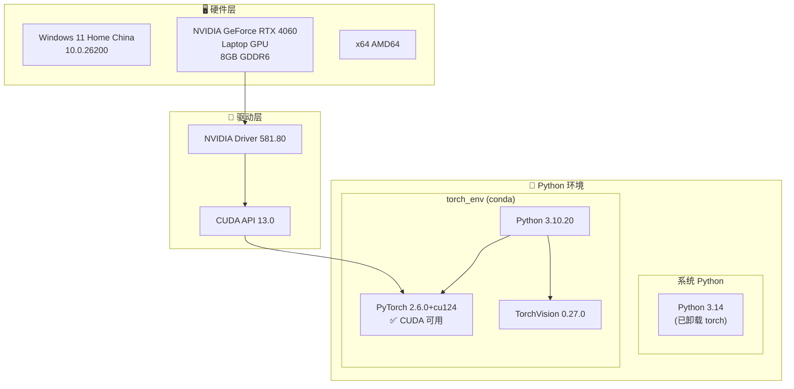
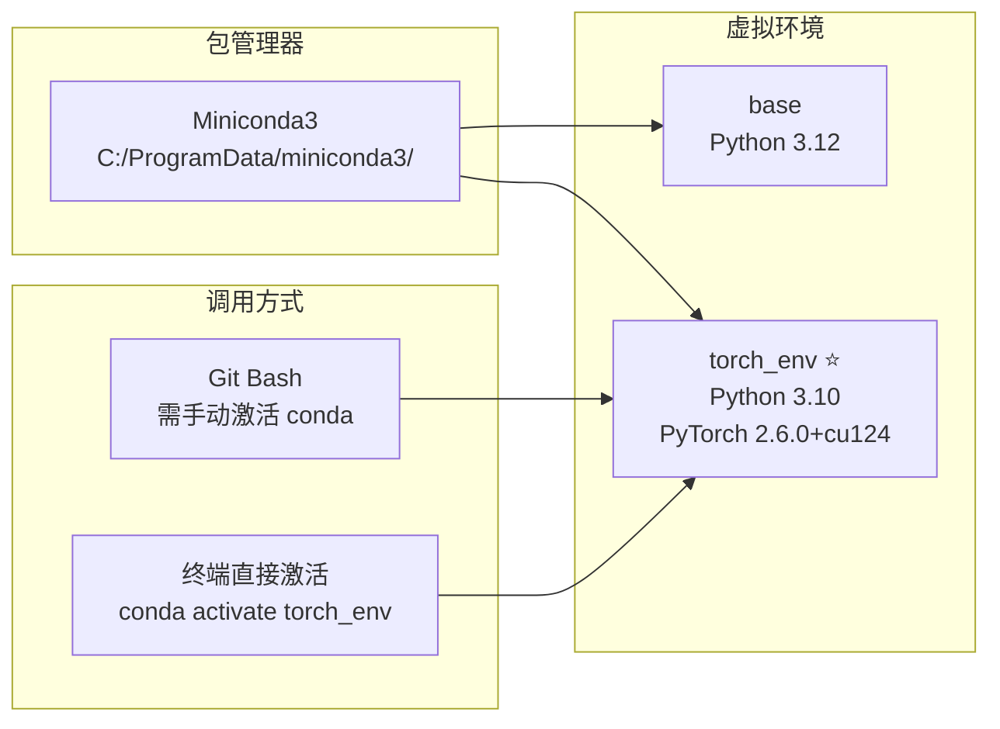
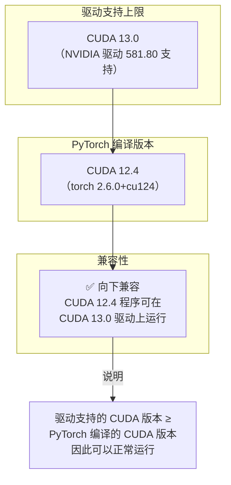
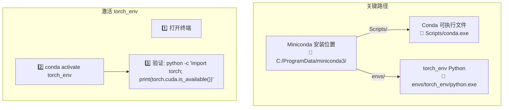

# 项目环境说明

## 设备概览

## 环境调用关系

## CUDA 兼容性

## 环境变量与路径

## 验证命令

| 检查项 | 命令 | 预期结果 |
|--------|------|----------|
| CUDA 驱动 | `nvidia-smi` | Driver 581.80, CUDA 13.0 |
| PyTorch 版本 | `python -c "import torch; print(torch.__version__)"` | `2.6.0+cu124` |
| CUDA 可用性 | `python -c "import torch; print(torch.cuda.is_available())"` | `True` |
| 显卡识别 | `python -c "import torch; print(torch.cuda.get_device_name(0))"` | `NVIDIA GeForce RTX 4060 Laptop GPU` |

> ⚠️ **注意**：运行 PyTorch 程序前，请确保已激活 `torch_env` 虚拟环境。
