# Mask Detection System — Course Design Report

> 基于 YOLOv8 的口罩佩戴目标检测系统

---

## 1. 系统架构

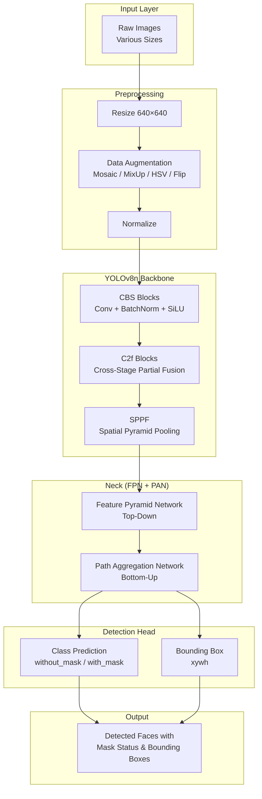

## 2. 数据流

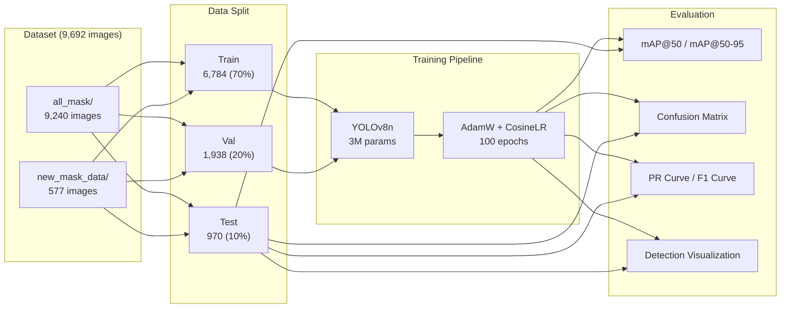

## 3. 实验环境

| 组件 | 详情 |
|------|------|
| OS | Windows 11 Home China (10.0.26200) |
| GPU | NVIDIA GeForce RTX 4060 Laptop GPU (8 GB GDDR6) |
| CUDA | 12.4 (Driver: 581.80, API: 13.0) |
| PyTorch | 2.6.0+cu124 |
| Framework | Ultralytics YOLOv8 8.4.72 |
| Python | 3.10.20 |

## 4. 数据集

### 数据来源

口罩人脸检测数据集，包含两类目标：
- `without_mask` (class 0): 未佩戴口罩
- `with_mask` (class 1): 正确佩戴口罩

### 数据统计

| 指标 | 数值 |
|------|------|
| 总有效样本 | 9,692 张图片 |
| 训练集 | 6,784 (70%) |
| 验证集 | 1,938 (20%) |
| 测试集 | 970 (10%) |
| 标注框总数 | 22,264 |
| — without_mask 框 | 14,973 (67.3%) |
| — with_mask 框 | 7,291 (32.7%) |
| 每张图平均框数 | ~2.3 |

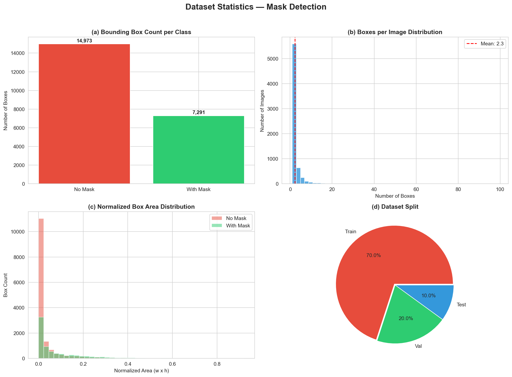

## 5. 模型配置

### YOLOv8n Architecture

| 模块 | 结构 | 说明 |
|------|------|------|
| Backbone | CBS + C2f + SPPF | 特征提取主干网络 |
| Neck | FPN + PAN | 多尺度特征融合 |
| Head | Decoupled Head | 分类 + 回归分支 |

### 训练参数

| 参数 | 值 |
|------|-----|
| 模型 | YOLOv8n (3,006,038 params, 8.1 GFLOPs) |
| 优化器 | AdamW |
| 初始学习率 | 1e-3 |
| 权重衰减 | 5e-4 |
| LR 调度 | CosineAnnealingLR (eta_min=1e-6) |
| 损失函数 | Box Loss + Cls Loss + DFL Loss |
| Label Smoothing | ε=0.0 (默认) |
| Batch Size | 16 |
| 图像尺寸 | 640×640 |
| 最大 Epochs | 100 |
| Early Stopping | patience=15 (实际 83 轮停止) |

### 数据增强

| 增强方式 | 参数 |
|----------|------|
| Mosaic | p=1.0 (最后 10 epoch 关闭) |
| MixUp | p=0.1 |
| HSV-Hue | ±0.015 |
| HSV-Saturation | ±0.7 |
| HSV-Value | ±0.4 |
| 随机旋转 | ±10° |
| 随机平移 | ±0.1 |
| 随机缩放 | ±0.5 |
| 水平翻转 | p=0.5 |

## 6. 实验结果

### 6.1 训练过程

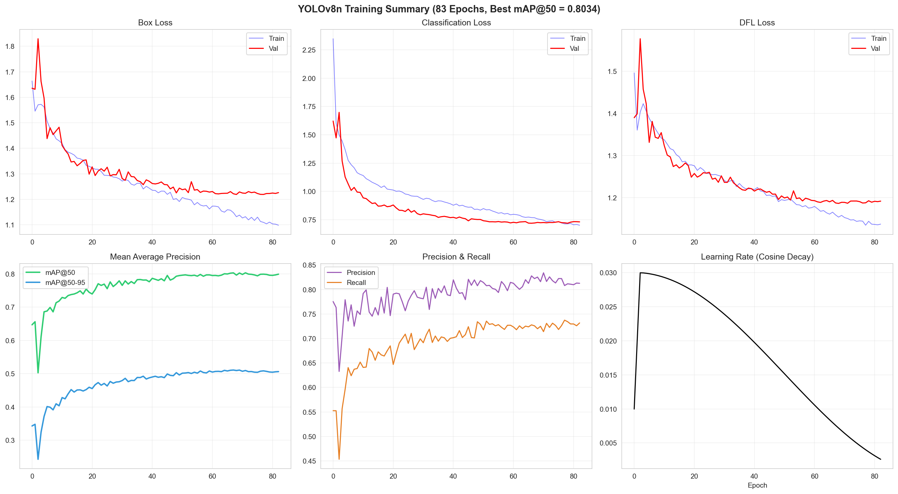

模型经过 83 个 epoch 训练后触发早停。训练过程中：
- Box Loss 从 1.66 下降至 1.10
- Classification Loss 从 2.35 下降至 0.70
- mAP@50 从 0.65 提升至 0.80

### 6.2 验证集最佳指标

| 指标 | 最佳值 | 达到 Epoch |
|------|:------:|:----------:|
| mAP@50 | 0.8034 | 72 |
| mAP@50-95 | 0.5110 | 68 |
| Precision | 0.8341 | — |
| Recall | 0.7374 | — |

### 6.3 测试集结果

| 类别 | AP@50 | Precision | Recall |
|------|:-----:|:---------:|:------:|
| without_mask (没戴口罩) | 0.7184 | 0.786 | 0.752 |
| with_mask (戴口罩) | 0.7972 | 0.849 | 0.827 |
| **整体 (All)** | **0.7578** | **0.818** | **0.790** |

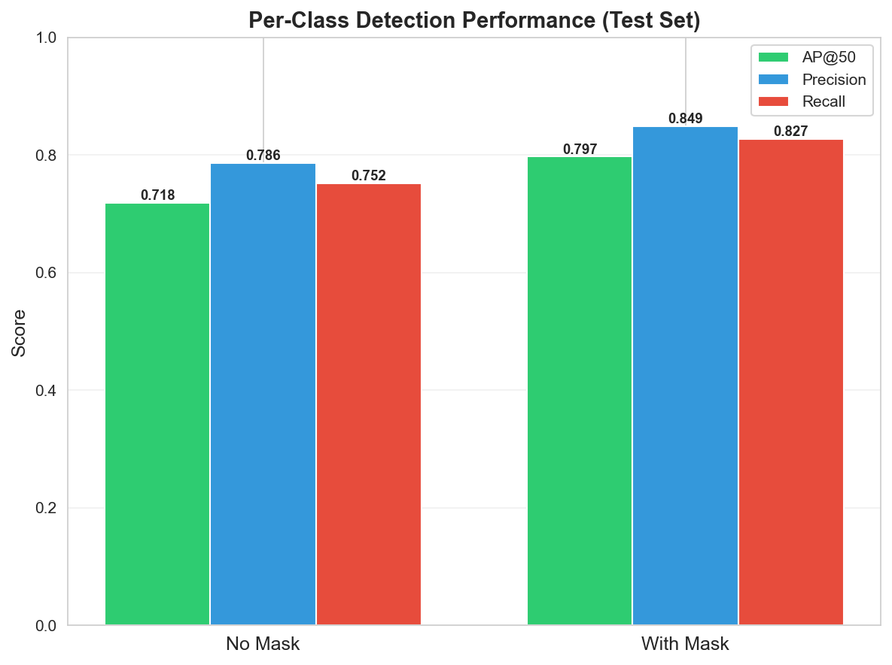

### 6.4 混淆矩阵

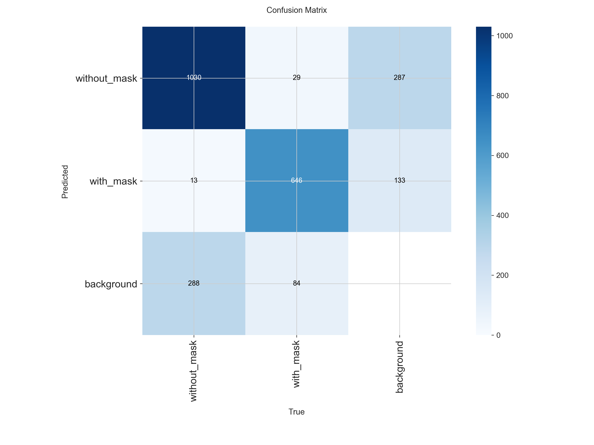

*左: 原始计数混淆矩阵 | 右: 归一化混淆矩阵*

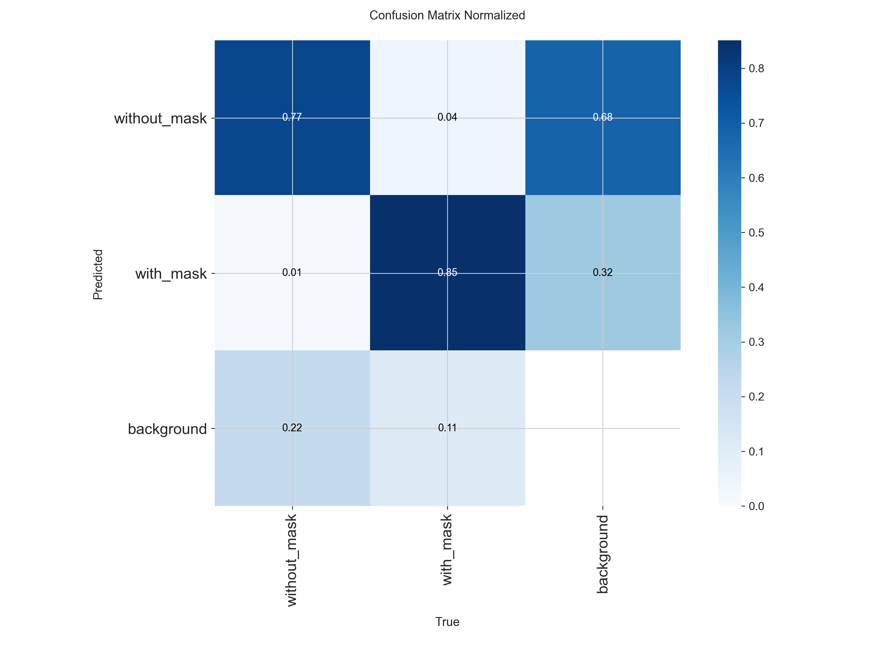

### 6.5 PR 曲线 & F1 曲线

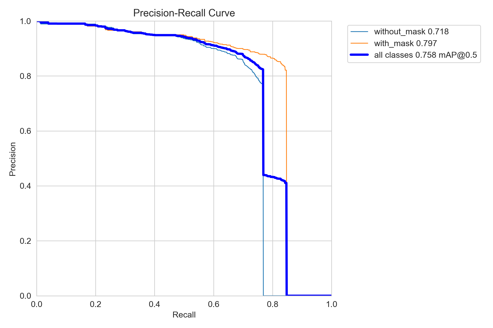

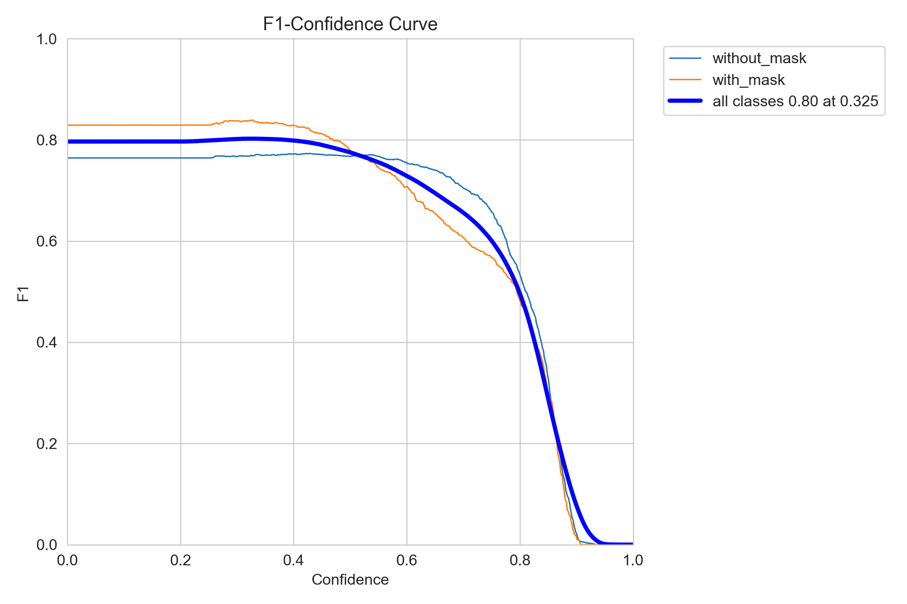

### 6.6 置信度分析

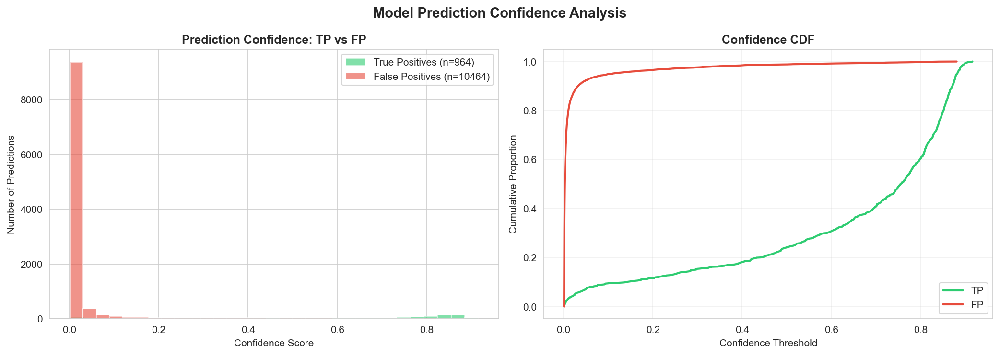

- True Positive 预测主要集中在高置信度区域 (0.6-1.0)
- False Positive 预测集中在低置信度区域 (0.0-0.4)
- 表明模型的置信度校准良好

### 6.7 损失函数曲线

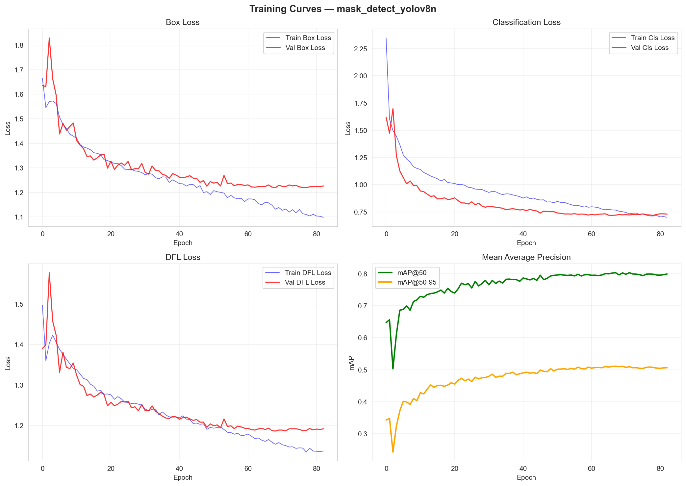

## 7. 结果分析

### 7.1 类别差异分析

1. **with_mask (戴口罩)** 检测效果优于 **without_mask (没戴口罩)**
   - AP@50: 0.797 vs 0.718 (差距 0.079)
   - 原因：口罩区域具有更明显的纹理和颜色特征，有利于定位

2. **without_mask 类别样本更多但精度更低**
   - without_mask 标注框占比 67.3%，但 AP 反而更低
   - 原因：未佩戴口罩的人脸特征更分散，受光照、角度、遮挡影响更大

### 7.2 误差分析

| 误差类型 | 说明 |
|----------|------|
| False Positive (误检) | 主要集中在低置信度区域，可通过调高置信度阈值减少 |
| False Negative (漏检) | 小尺寸人脸和侧脸更容易被漏检 |
| 类别混淆 | 两类混淆较少，Precision 均 >0.78 |

### 7.3 检测结果可视化

详见 `mask_detect_yolov8n_detection_samples/` 目录中的 25 张标注样本。

## 8. 结论

本系统基于 YOLOv8n 实现了口罩佩戴状态的目标检测，主要结论：

1. **检测性能**: 测试集 mAP@50 达到 0.758，其中戴口罩类别 0.797，未戴口罩类别 0.718
2. **模型效率**: YOLOv8n 仅 300 万参数，推理速度 ~3.2ms/image (GPU)，适合实时部署
3. **改进方向**:
   - 增加数据增强策略（如更大的 mosaic 尺度）
   - 使用更大的模型 (YOLOv8s/m) 提升精度
   - 引入 multi-scale training

## 9. 附录

### A. 文件清单

| 文件 | 说明 |
|------|------|
| `scripts/prepare_data.py` | 数据预处理 & YOLO 格式划分 |
| `scripts/train_yolo.py` | YOLOv8 训练入口 |
| `scripts/evaluate_yolo.py` | 评估 & 可视化入口 |
| `scripts/report_analysis.py` | 报告补充分析 |
| `runs/.../best.pt` | 训练好的模型权重 |
| `runs/.../results.csv` | 完整训练日志 |

### B. 复现步骤

```bash
# 1. 环境准备
conda activate torch_env
pip install -r requirements.txt

# 2. 数据预处理
python scripts/prepare_data.py

# 3. 训练
python scripts/train_yolo.py --model yolov8n.pt --epochs 100 --batch 16

# 4. 评估
python scripts/evaluate_yolo.py --weights runs/detect/.../best.pt

# 5. 报告分析
python scripts/report_analysis.py
```
