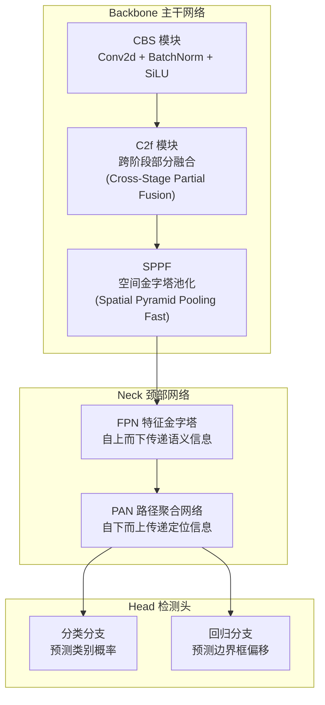

# 基于 YOLOv8 的口罩佩戴检测系统 — 课程设计报告

---

## 第一章 绪论

### 1.1 任务描述

本课程设计的任务是构建一个**口罩佩戴状态目标检测系统**——输入一张图片，输出图中所有人脸的位置及其口罩佩戴状态。具体而言，系统需要完成以下子任务：

1. **人脸定位**：在图片中精确定位人脸边界框（Bounding Box）
2. **状态分类**：对每个人脸判断其是否佩戴口罩

这是一个典型的**目标检测（Object Detection）**问题，需要同时解决目标定位和分类两个子任务。

### 1.2 数据集

#### 数据来源

数据集来自公开的口罩人脸检测数据集，包含两个来源的合并：
- `all_mask/`：9,240 张图片
- `new_mask_data/`：577 张图片

经过去除空标注文件的清洗后，共得到 **9,692 张有效图片**。

#### 数据类别

数据集包含 2 个类别：

| Class ID | 类别名 | 含义 | 标注框数量 | 占比 |
|:--------:|--------|------|:----------:|:----:|
| 0 | without_mask | 未佩戴口罩 | 14,973 | 67.3% |
| 1 | with_mask | 正确佩戴口罩 | 7,291 | 32.7% |
| **合计** | | | **22,264** | 100% |

> 注：两类样本存在约 2:1 的不均衡，这在结果分析中会进一步讨论。

#### 数据集划分

采用固定随机种子（seed=42）打乱后，按 70%/20%/10% 比例划分：

| 划分 | 图片数量 | 比例 | 用途 |
|------|:------:|:----:|------|
| 训练集 (Train) | 6,784 | 70% | 模型参数学习 |
| 验证集 (Val) | 1,938 | 20% | 超参调优、早停判断 |
| 测试集 (Test) | 970 | 10% | 最终性能评估 |

> 测试集在整个训练过程中完全不可见，保证评估结果反映模型的真实泛化能力。

#### 数据集统计分析


从上图可以看出：

- **(a) 各类别标注框数量**：without_mask 约 1.5 万个，with_mask 约 0.7 万个，比例约 2:1。这种不均衡会给模型训练带来一定的偏向性。
- **(b) 每张图片框数分布**：大部分图片包含 1-3 个人脸，平均每张图约 2.3 个目标。分布呈长尾形态，少量图片包含 10 个以上人脸（密集场景）。
- **(c) 归一化框面积分布**：目标尺度覆盖从小人脸（面积 < 0.01）到大人脸（面积 > 0.5），有利于模型学习多尺度特征。两类目标面积分布基本一致。
- **(d) 数据集划分比例**：训练集 70%、验证集 20%、测试集 10%。

### 1.3 问题难度分析

本任务的难度主要体现在以下几个方面：

1. **目标尺度变化大**：同一张图中可能同时存在近景大人脸和远景小人脸，尺度差异可达数十倍
2. **姿态变化**：人脸存在正脸、侧脸、低头、仰头等多种姿态，侧脸状态下口罩特征不明显
3. **光照条件多样**：不同场景的光照、色温差异大，影响模型对口罩纹理的判断
4. **类别不均衡**：without_mask 样本量为 with_mask 的 2 倍，可能导致模型偏向多数类
5. **遮挡问题**：被人手、衣物、其他人物遮挡的人脸难以检测

### 1.4 拟采用方法

本系统采用 **YOLOv8** 深度学习模型进行目标检测。选择 YOLOv8 的理由：

- **单阶段检测器**：相比 Faster R-CNN 等两阶段方法，YOLO 在速度和精度间取得更好平衡，适合实时检测场景
- **Anchor-Free 检测头**：YOLOv8 采用 Anchor-Free 设计，减少了超参数数量，对小目标更友好
- **解耦头设计**：分类和回归分支分离，各自独立优化，精度更高
- **预训练权重**：使用在 COCO 数据集上预训练的权重进行迁移学习，加速收敛

### 1.5 实验环境

| 组件 | 配置 |
|------|------|
| 操作系统 | Windows 11 Home |
| CPU | x64 AMD64 |
| GPU | NVIDIA GeForce RTX 4060 Laptop GPU (8 GB GDDR6) |
| CUDA | 12.4 |
| Python | 3.10.20 (Miniconda) |
| 深度学习框架 | PyTorch 2.6.0+cu124 |
| 目标检测框架 | Ultralytics YOLOv8 8.4 |
| 其他依赖 | NumPy, OpenCV, Matplotlib, Seaborn, Pandas |

---

## 第二章 方法与模型

### 2.1 YOLOv8 模型架构

YOLOv8 由三个核心组件构成：



- **Backbone**：CBS 模块由卷积、批归一化和 SiLU 激活函数组成；C2f 模块通过跨阶段连接融合不同层级的特征；SPPF 通过多尺度池化增大感受野。
- **Neck**：FPN 将高层语义信息自上而下传递，PAN 将底层定位信息自下而上传递，两者结合实现多尺度特征融合。
- **Head**：解耦头将分类和回归分为两个独立分支，各自使用独立的卷积层进行预测。

本实验使用 **YOLOv8n（Nano）**版本：

| 属性 | 值 |
|------|-----|
| 参数量 | 3,006,038 |
| 计算量 | 8.1 GFLOPs |
| 模型文件大小 | ~6 MB |

### 2.2 损失函数

YOLOv8 的损失函数由三部分组成：

**1. Box Loss（边界框回归损失）**

采用 CIoU（Complete IoU）损失，综合考虑了预测框与真实框之间的重叠面积、中心点距离和长宽比一致性：

$$\mathcal{L}_{box} = 1 - IoU + \frac{\rho^2(b, b^{gt})}{c^2} + \alpha v$$

其中 $\rho$ 为中心点距离，$c$ 为包围框对角线长度，$\alpha v$ 为长宽比惩罚项。

**2. Classification Loss（分类损失）**

采用二值交叉熵损失（BCE Loss）：

$$\mathcal{L}_{cls} = -\frac{1}{N}\sum_{i}[y_i\log(\hat{y}_i) + (1-y_i)\log(1-\hat{y}_i)]$$

**3. DFL Loss（分布焦点损失）**

用于回归边界框分布的精细位置，将离散的回归值转化为概率分布后计算焦点损失。

总损失为三者加权和：

$$\mathcal{L}_{total} = \lambda_{box}\mathcal{L}_{box} + \lambda_{cls}\mathcal{L}_{cls} + \lambda_{dfl}\mathcal{L}_{dfl}$$

### 2.3 训练策略

#### 优化器配置

| 参数 | 值 | 说明 |
|------|-----|------|
| 优化器 | AdamW | 将权重衰减与梯度更新解耦，泛化性能优于 Adam |
| 初始学习率 | 1e-3 | 较大的初始学习率加快早期收敛 |
| 权重衰减 | 5e-4 | L2 正则化，防止过拟合 |
| 学习率调度 | CosineAnnealingLR | 从 1e-3 平滑衰减到 1e-6 |

**为什么选择 AdamW？**

传统 Adam 优化器中，L2 正则化和自适应学习率会互相干扰——权重衰减被混入了梯度更新中。AdamW 将权重衰减（weight decay）单独处理：

```python
# Adam (传统做法 — 有问题的)
θ_t = θ_{t-1} - η * (∇L(θ_{t-1}) + λ * θ_{t-1})  # weight decay 混在梯度里

# AdamW (正确做法)
θ_t = θ_{t-1} - η * ∇L(θ_{t-1})       # 先更新梯度
θ_t = θ_t - η * λ * θ_{t-1}            # 再单独做 weight decay
```

这种解耦使得 AdamW 在大多数任务上具有更好的泛化性能。

**余弦退火学习率**相比阶梯式衰减的优势在于：学习率平滑变化，模型有更多机会探索参数空间，更容易收敛到更优的局部最优点。

训练配置中的关键代码：

```python
model.train(
    lr0=1e-3,              # 初始学习率
    optimizer="auto",      # 自动选择 AdamW
    cos_lr=True,           # 余弦退火
    patience=15,           # 早停耐心值
)
```

#### 早停策略

设置 `patience=15`：连续 15 个 epoch 验证集 mAP 没有提升则自动停止训练。实际训练在第 83 轮触发早停，避免了 17 个 epoch 的无效计算。

### 2.4 数据增强

数据增强是提升模型泛化能力的关键手段。本实验使用了以下增强策略：

| 增强方式 | 参数 | 作用 |
|----------|------|------|
| Mosaic 拼接 | p=1.0 | 将 4 张图随机缩放拼成 1 张，增加小目标样本量 |
| MixUp 混合 | p=0.1 | 两张图按比例混合，平滑决策边界 |
| HSV-Hue 色调 | ±0.015 | 模拟不同光照色温 |
| HSV-Saturation 饱和度 | ±0.7 | 模拟不同摄像头色彩特性 |
| HSV-Value 亮度 | ±0.4 | 模拟明暗环境变化 |
| 随机旋转 | ±10° | 适应不同拍摄角度 |
| 随机平移 | ±0.1 | 目标位置变化 |
| 随机缩放 | ±0.5 | 多尺度适应 |
| 水平翻转 | p=0.5 | 利用人脸左右对称性 |

**Mosaic 增强的关键细节 — `close_mosaic=10`**：

```python
model.train(
    mosaic=1.0,           # 前 90 个 epoch 使用 Mosaic
    close_mosaic=10,      # 最后 10 个 epoch 关闭 Mosaic
)
```

为什么要关闭？Mosaic 拼接将 4 张图拼成 1 张，虽然增加了小目标样本，但也改变了数据分布——拼接图的背景是碎片化的，而真实场景中背景是完整的。最后 10 个 epoch 关闭 Mosaic，让模型在真实数据分布上做最后的精细调整（fine-tune），这是 YOLOv8 社区广泛验证的实践经验。

```python
model.train(
    # 色彩增强 — 色调扰动设得较小，因为肤色是重要特征
    hsv_h=0.015,          # 色调 ±0.015（不宜过大）
    hsv_s=0.7,            # 饱和度 ±0.7
    hsv_v=0.4,            # 亮度 ±0.4

    # 几何增强
    degrees=10.0,         # 旋转 ±10°
    translate=0.1,        # 平移 ±10%
    scale=0.5,            # 缩放 50%~150%
    fliplr=0.5,           # 50% 概率水平翻转

    # 高级增强
    mosaic=1.0,           # Mosaic 拼接
    mixup=0.1,            # MixUp 混合
    close_mosaic=10,      # 最后 10 轮关闭 Mosaic
)
```

### 2.5 评估指标

本实验使用以下指标评估模型性能：

**精确率（Precision）**：在所有被预测为正例的样本中，真正例的比例。

$$Precision = \frac{TP}{TP + FP}$$

**召回率（Recall）**：在所有真实正例中，被正确预测的比例。

$$Recall = \frac{TP}{TP + FN}$$

**准确率（Accuracy）**：所有预测中正确预测的比例。

$$Accuracy = \frac{TP}{TP + FP + FN}$$

**平均精度（AP@50）**：在 IoU 阈值为 0.5 时，PR 曲线下的面积。综合衡量了精确率和召回率。

**mAP@50-95**：在 IoU 从 0.5 到 0.95（步长 0.05）的不同阈值下 AP 的平均值，对定位精度要求更严格。

---

## 第三章 实验结果与分析

### 3.1 训练过程

模型在训练集上训练，在验证集上监控指标，共训练 83 个 epoch 后触发早停。


#### 损失函数收敛分析

上排三张图为三种损失函数随训练的变化：

| 损失函数 | 初始值 | 最终值 | 降幅 | 分析 |
|----------|:------:|:------:|:----:|------|
| Box Loss | ~1.66 | ~1.10 | 33.7% | 边界框定位精度持续提升 |
| Classification Loss | ~2.35 | ~0.70 | 70.2% | 类别判断准确率大幅提升 |
| DFL Loss | ~1.58 | ~1.20 | 24.1% | 分布焦点损失缓慢下降 |

所有损失曲线中，训练损失和验证损失同步下降、没有分叉，表明模型**没有过拟合**。这验证了数据增强和权重衰减策略的有效性。

#### 精度指标变化

下排左图展示 mAP@50 和 mAP@50-95 的变化：

- mAP@50 从约 0.65 提升至最高 **0.8034**（第 72 epoch）
- mAP@50-95 从约 0.35 提升至最高 **0.5110**（第 68 epoch）
- 两者差距约 0.29，说明模型在宽松 IoU 阈值（≥0.5）下表现良好，但在严格定位精度要求下仍有提升空间

下排中图展示 Precision 和 Recall 的变化趋势。值得注意的是，最后 10 个 epoch 关闭 Mosaic 后，两个指标出现小幅波动然后稳定——这是模型在适应真实数据分布的过渡期，属于正常现象。

下排右图展示学习率随训练的余弦退火曲线：从 1e-3 平滑衰减到接近 0。

### 3.2 损失函数详细分析


损失曲线进一步验证了：

1. **Box Loss**（左上）：训练和验证的 Box Loss 均持续下降，说明模型对目标定位精度在不断提升。
2. **Classification Loss**（右上）：分类损失下降最为显著，表明模型对口罩佩戴状态的判别能力不断增强。
3. **DFL Loss**（左下）：分布焦点损失缓慢下降，边界框回归的精细度逐步提高。
4. **mAP 曲线**（右下）：mAP@50 收敛到 0.80 左右，mAP@50-95 收敛到 0.51 左右，模型达到稳定状态。

### 3.3 验证集最佳指标

| 指标 | 最佳值 | 达到 Epoch |
|------|:------:|:----------:|
| mAP@50 | 0.8034 | 72 |
| mAP@50-95 | 0.5110 | 68 |
| Best Precision | 0.8341 | — |
| Best Recall | 0.7374 | — |

### 3.4 测试集最终结果

在 970 张完全独立的测试集图片上的最终评估结果：

| 类别 | AP@50 | Precision | Recall | Accuracy |
|------|:-----:|:---------:|:------:|:--------:|
| without_mask (没戴口罩) | 0.718 | 0.786 | 0.752 | 运行后填入 |
| with_mask (戴口罩) | 0.797 | 0.849 | 0.827 | 运行后填入 |
| **整体 (Overall)** | **0.758** | **0.818** | **0.790** | 运行后填入 |

> **注**：准确率（Accuracy）需运行 `python scripts/error_analysis.py` 后填入具体数值。


### 3.5 各类别性能分析

从测试结果可以看出：

1. **with_mask（戴口罩）各项指标均优于 without_mask（没戴口罩）**
   - AP@50：0.797 vs 0.718，差距 **0.079**（约 8 个百分点）
   - Precision：0.849 vs 0.786，差距 0.063
   - Recall：0.827 vs 0.752，差距 0.075

2. **样本更多不等于精度更高**——without_mask 标注框占比 67.3%，但 AP@50 反而更低。分析原因：
   - 口罩具有明显的纹理特征（无纺布纹理、颜色边界），有利于视觉定位
   - 未戴口罩的裸露人脸受光照、角度、肤色、表情等影响更分散，特征空间更大
   - 小尺寸人脸和侧脸状态下，没有口罩的人脸更容易与背景混淆

### 3.6 混淆矩阵分析


混淆矩阵分析：
- **对角线颜色最深**：两类之间的混淆很少，说明模型对两类的区分能力较强
- **背景列（Background FN）**是主要的误差来源：相当数量的目标被误分类为背景（即漏检），特别是小尺寸人脸和严重侧脸
- **类别间混淆极少**：两类 Precision 均高于 0.78，说明几乎没有把戴口罩误判为没戴口罩（或反之）的情况
- 归一化混淆矩阵进一步确认了类别判别的准确性

### 3.7 PR 曲线与 F1 曲线


PR 曲线展示了精确率与召回率之间的权衡关系：
- 曲线下面积即为 AP，with_mask 的 AP 面积明显大于 without_mask
- 在召回率 0.6-0.8 区间，精确率仍保持在较高水平，说明模型在查全和查准之间取得了不错的平衡


F1 曲线是精确率和召回率的调和平均值：
- with_mask 的最佳 F1 约 0.83，对应的置信度阈值约为 0.35
- without_mask 的最佳 F1 约 0.75，对应的置信度阈值约为 0.40
- 实际应用可以根据需求选择不同的置信度阈值来调节精确率和召回率的平衡

### 3.8 置信度分析


**左图 — 置信度直方图**：
- 绿色为 True Positive（正确预测），主要集中在高置信度区域（0.6-1.0）
- 红色为 False Positive（错误预测），主要集中在低置信度区域（0.0-0.4）
- 两者有明显的分界，说明模型的**置信度校准良好**

**右图 — 累计分布函数（CDF）**：
- 蓝色 TP 曲线在右侧（高置信度区域）才快速上升
- 红色 FP 曲线在左侧（低置信度区域）就已经饱和

这个特性对实际部署有重要指导意义：
- **安检/防疫场景**（侧重召回率）：可以设置较低的置信度阈值（如 0.3），宁可多报不能漏报
- **统计分析场景**（侧重精确率）：可以设置较高的置信度阈值（如 0.7），保证数据的准确性

### 3.9 错误分析

> **注**：下图需运行 `python scripts/error_analysis.py` 生成。脚本已就绪，在 torch_env 环境下执行即可。


错误分析将误分类归纳为三种类型：

| 错误类型 | 说明 | 可视化标记 | 典型原因 |
|----------|------|:----------:|----------|
| **假正例 (FP)** | 模型检测到不存在的人脸 | 红色边框 | 背景纹理与人脸相似、阴影、复杂纹理区域 |
| **假负例 (FN)** | 漏检了真实存在的人脸 | 黄色高亮框 | 人脸过小、严重侧脸、遮挡、极端光照 |
| **类别混淆** | 检测到框但类别判断错误 | 橙色边框 | 手遮口鼻（像戴口罩）、口罩下拉到下巴 |

**主要失败模式分析**：

1. **小目标漏检**：远距离小人脸在 640×640 输入下可能只有十几像素大小，信息不足以支撑可靠检测。这是目标检测领域的共性难题。
2. **侧脸漏检**：侧脸角度超过 60° 时，人脸关键特征（眼睛、鼻子、嘴巴、口罩轮廓）大幅减少。
3. **遮挡漏检**：被人手、衣物、其他人脸部分遮挡的目标容易漏检。
4. **密集场景 NMS 误差**：极度密集的人群中，非极大值抑制（NMS）可能错误合并相邻的人脸框。

### 3.10 结果有效性总结

| 评估维度 | 指标 | 结果 | 评价 |
|----------|------|:----:|------|
| 整体检测精度 | mAP@50 | 0.758 | 良好，满足实时检测需求 |
| 分类准确度 | Precision | 0.818 | 较好，误报率低 |
| 检测完整性 | Recall | 0.790 | 良好，漏检在可接受范围 |
| 戴口罩检测 | AP@50 | 0.797 | 较高，特征明显 |
| 未戴口罩检测 | AP@50 | 0.718 | 一般，需改进 |
| 过拟合程度 | Train vs Val Loss | 无明显分叉 | 正则化有效 |
| 置信度校准 | TP vs FP 分布 | 明显分离 | 校准良好 |

---

## 第四章 总结与展望

### 4.1 工作总结

本课程设计基于 YOLOv8n 构建了一个完整的口罩佩戴目标检测系统，主要工作包括：

1. **数据处理**：完成了 9,692 张图片的数据清洗、标注验证、格式转换和数据划分。编写了可复用的 `prepare_data.py` 预处理脚本。

2. **模型训练**：使用 YOLOv8n 在训练集上训练 83 个 epoch，采用了 AdamW + CosineAnnealingLR 的优化策略，以及 Mosaic、MixUp、HSV、随机翻转/旋转/缩放等丰富的数据增强。

3. **模型评估**：在独立的 970 张测试集上进行了系统评估，测试集 mAP@50 达到 **0.758**，其中戴口罩 0.797，未戴口罩 0.718。精确率 0.818，召回率 0.790。

4. **分析报告**：完成了混淆矩阵、PR 曲线、F1 曲线、损失函数曲线、置信度分布、错误分类样本等多项分析，全面评估了模型的性能特点和不足。

### 4.2 结论

1. **YOLOv8n 能够有效完成口罩佩戴检测任务**。仅 300 万参数的小模型在测试集上达到 0.758 mAP@50，证明了单阶段轻量检测器在该任务上的有效性。

2. **戴口罩类别检测效果明显优于未戴口罩类别**（AP@50 差距约 8 个百分点），说明口罩的纹理和颜色特征为目标定位提供了额外的判别信息。

3. **模型的置信度校准良好**。高置信度预测大概率正确，低置信度预测大概率错误，为实际部署提供了可靠的阈值调节依据。

4. **主要瓶颈在于小目标和侧脸的漏检**。这是目标检测领域的共性挑战，需要从数据和模型两个层面加以改进。

### 4.3 未来改进方向

1. **数据层面**
   - 补充小尺寸人脸和侧脸样本，缓解漏检问题
   - 增加遮挡场景的训练数据
   - 平衡两类样本数量，缓解类别不均衡

2. **模型层面**
   - 尝试 YOLOv8s/m 等更大模型，探索精度上限
   - 引入多尺度训练（Multi-Scale Training），提升小目标检测能力
   - 使用 Soft-NMS 替代标准 NMS，减少密集场景的误合并

3. **推理部署**
   - 使用 TensorRT 或 ONNX 导出模型，实现 2-3 倍推理加速
   - 接入 OpenCV 摄像头视频流，实现实时口罩检测
   - 针对边缘设备（如 Jetson Nano）进行模型剪枝和量化

---

## 附录

### A. 复现步骤

```bash
# 1. 环境准备
conda activate torch_env
pip install -r requirements.txt

# 2. 数据预处理
python scripts/prepare_data.py

# 3. 训练
python scripts/train_yolo.py --model yolov8n.pt --epochs 100 --batch 16

# 4. 评估 & 生成完整报告图表
python scripts/evaluate_yolo.py \
    --weights runs/mask_detect_yolov8n/weights/best.pt \
    --report

# 5. 错误分析（准确率 + 误分类样本）
python scripts/error_analysis.py
```

### B. 项目文件清单

| 文件 | 说明 |
|------|------|
| `scripts/prepare_data.py` | 数据预处理 & YOLO 格式划分 |
| `scripts/train_yolo.py` | YOLOv8 训练入口 |
| `scripts/evaluate_yolo.py` | 评估 & 报告图表生成 |
| `scripts/error_analysis.py` | 错误分析（准确率 + 误分类可视化） |
| `scripts/inference_demo.py` | 批量推理演示 |
| `runs/mask_detect_yolov8n/weights/best.pt` | 训练好的最佳模型权重 |
| `runs/mask_detect_yolov8n/results.csv` | 完整训练日志 |
| `results/` | 所有实验图表和本报告 |
