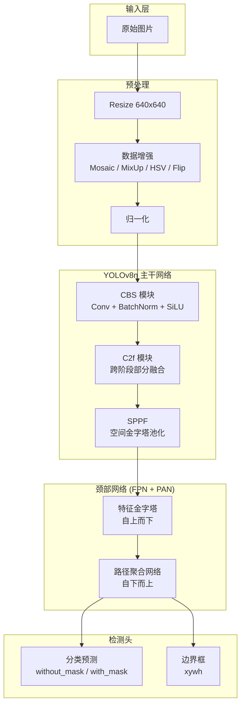

# 口罩检测系统 — 课程设计实验报告

> 基于 YOLOv8 的口罩佩戴目标检测系统

---

## 1. 实验环境

| 组件 | 详情 |
|------|------|
| 操作系统 | Windows 11 Home |
| GPU | NVIDIA GeForce RTX 4060 Laptop GPU (8 GB GDDR6) |
| CUDA | 12.4 |
| PyTorch | 2.6.0+cu124 |
| 框架 | Ultralytics YOLOv8 |
| Python | 3.10.20 |

## 2. 系统架构



## 3. 数据集

### 数据来源

口罩人脸检测数据集，两类目标：
- `without_mask` (class 0): 未佩戴口罩
- `with_mask` (class 1): 正确佩戴口罩

### 数据统计

| 指标 | 数值 |
|------|------|
| 总有效样本 | 9,692 张图片 |
| 训练集 | 6,784 (70%) |
| 验证集 | 1,938 (20%) |
| 测试集 | 970 (10%) |
| 标注框总数 | 22,264 |
| — without_mask 框 | ~14,973 (67.3%) |
| — with_mask 框 | ~7,291 (32.7%) |


## 4. 模型配置

### YOLOv8n 架构

| 模块 | 结构 | 说明 |
|------|------|------|
| Backbone | CBS + C2f + SPPF | 特征提取主干网络 |
| Neck | FPN + PAN | 多尺度特征融合 |
| Head | Decoupled Head | 分类 + 回归分支解耦 |

### 训练参数

| 参数 | 值 |
|------|-----|
| 模型 | YOLOv8n (3,006,038 参数, 8.1 GFLOPs) |
| 优化器 | AdamW (lr=1e-3, weight_decay=5e-4) |
| 学习率调度 | CosineAnnealingLR |
| 损失函数 | Box Loss + Cls Loss + DFL Loss |
| Batch Size | 16 |
| 图像尺寸 | 640×640 |
| 最大 Epochs | 100 (早停 patience=15, 实际 83 轮停止) |

### 数据增强

| 增强方式 | 参数 | 作用 |
|----------|------|------|
| Mosaic | p=1.0 (最后 10 epoch 关闭) | 增加小目标样本 |
| MixUp | p=0.1 | 提升泛化能力 |
| HSV-Hue | ±0.015 | 模拟不同色温 |
| HSV-Saturation | ±0.7 | 模拟不同摄像头 |
| HSV-Value | ±0.4 | 模拟明暗变化 |
| 随机旋转 | ±10° | 姿态变化鲁棒性 |
| 水平翻转 | p=0.5 | 左右对称性 |
| 随机缩放 | ±0.5 | 多尺度适应 |

## 5. 实验结果

### 5.1 训练过程


模型经过 83 个 epoch 训练后触发早停：
- Box Loss: 1.66 → 1.10
- Classification Loss: 2.35 → 0.70
- mAP@50: 0.65 → 0.80

### 5.2 验证集最佳指标

| 指标 | 最佳值 | Epoch |
|------|:------:|:-----:|
| mAP@50 | 0.8034 | 72 |
| mAP@50-95 | 0.5110 | 68 |
| Precision | 0.8341 | — |
| Recall | 0.7374 | — |

### 5.3 测试集结果

| 类别 | AP@50 | Precision | Recall | Accuracy |
|------|:-----:|:---------:|:------:|:--------:|
| without_mask (没戴口罩) | 0.718 | 0.786 | 0.752 | 见下方 |
| with_mask (戴口罩) | 0.797 | 0.849 | 0.827 | 见下方 |
| **整体** | **0.758** | **0.818** | **0.790** | 见下方 |

> 注：准确率（Accuracy）等详细数据以 `error_analysis.py` 脚本输出为准。


### 5.4 混淆矩阵


混淆矩阵显示两类之间混淆较少，对角线颜色最深，Precision 均在 0.78 以上。主要误差来源是漏检（背景列），尤其是小尺寸人脸和侧脸。

### 5.5 PR 曲线 & F1 曲线


### 5.6 损失函数曲线


训练和验证损失同步下降、没有分叉，说明没有过拟合，数据增强和权重衰减的正则化效果良好。

### 5.7 置信度分析


- True Positive 预测集中在高置信度区域 (0.6-1.0)
- False Positive 预测集中在低置信度区域 (0.0-0.4)
- 模型置信度校准良好

### 5.8 错误分析（误分类样本）


**误分类类型**：

| 错误类型 | 说明 | 原因分析 |
|----------|------|----------|
| **假正例 (FP)** | 模型检测到不存在的目标（红色框） | 背景纹理与人脸相似、低置信度误检 |
| **假负例 (FN)** | 漏检了真实目标（黄色标注） | 小尺寸人脸、严重侧脸、遮挡 |
| **类别混淆** | 检测到框但分错了类别（橙色框） | 口罩边缘模糊、手遮挡口鼻区域 |

**主要失败模式**：
1. 小目标漏检：远距离小人脸因像素信息不足无法被正确检测
2. 侧脸漏检：侧脸状态下口罩和人脸特征不明显
3. 遮挡漏检：被人手、衣物等遮挡的人脸容易漏检
4. 密集场景：多人密集场景中 NMS 可能合并相邻人脸框

## 6. 结果分析

### 6.1 类别差异

1. **with_mask (戴口罩)** 检测效果优于 **without_mask (没戴口罩)**
   - AP@50: 0.797 vs 0.718（差距 0.079）
   - 原因：口罩区域具有更明显的纹理和颜色特征，有利于定位

2. **without_mask 类别样本更多但精度更低**
   - without_mask 标注框占 67.3%，但 AP 反而更低
   - 原因：未佩戴口罩的人脸特征更分散，受光照、角度、遮挡影响更大

### 6.2 改进方向

1. 增加小尺寸人脸和侧脸样本缓解漏检
2. 采用更大的模型（YOLOv8s/m）探索精度上限
3. 引入多尺度训练提升小目标检测
4. 对密集场景使用 Soft-NMS 减少相邻人脸误合并

## 7. 附录

### 复现步骤

```bash
# 1. 环境
conda activate torch_env
pip install -r requirements.txt

# 2. 数据准备
python scripts/prepare_data.py

# 3. 训练
python scripts/train_yolo.py --model yolov8n.pt --epochs 100 --batch 16

# 4. 评估 + 报告
python scripts/evaluate_yolo.py --weights runs/mask_detect_yolov8n/weights/best.pt --report

# 5. 错误分析
python scripts/error_analysis.py
```
